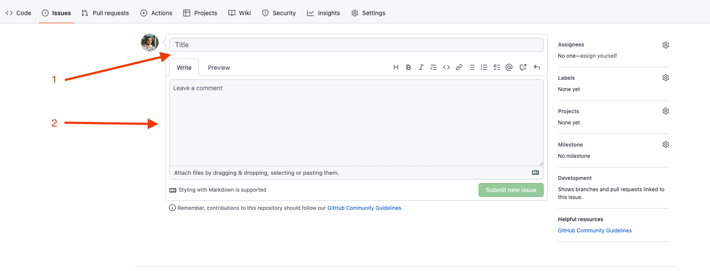
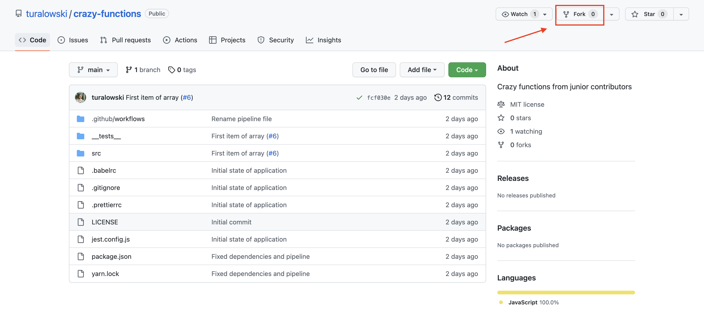

# Crazy Functions

<!-- [](https://opensource.org/licenses/MIT) -->

[](https://twitter.com/turalowski)

Digər dillərdə oxuyun: [İngilis dili](README.md)

## Ümumi məlumat

Bu proyektin məqsədi, yeni başlayan və öyrənməkdə davam edən JavaScript developerlə açıq qaynaq kodlarla işləməyi və dəstək olmağı göstərməkdir. 

**Çətinlik çəkdiyiniz mərhələ olarsa deməli düzgün izah olunmayıb. Bununla bağlı məsələ(issue) yaratmaqdan çəkinməyin**

Bütün mərhələləri izlədikdən sonra, aşağıdakı təcrübələriniz olacaq:

1. Github proyektlərində problem(issue) yaratmaq.
2. Proyekti kopyalamaq(clone) və nüsxəsini yaratmaq(fork).
3. Yaratdığınız problemlərə uyğun olaraq dəyişiklikləri saxlaya biləcəyiniz budaq(branch) yaratmaq, yazdığınız testləri yoxlamaq və dəyişiklikləri əsas proyektə ötürmək.
4. Birləşmə sorğusu yaratmaq.

**Bu sizin ilk uğurlu birləşmə sorğunuz olacaqsa, github tərəfindən bir-neçə mükafatlar əldə edəcəksiniz. Mükafatların siyahısı ilə [buradan](https://github.com/Schweinepriester/github-profile-achievements) tanış ola bilərsiniz.**

**Başlamazdan öncə kompyuterinizdə git və node-un qurulu olduğundan əmin olun**

## Proyektin ümumi strukturu

```
.
├── __tests__
│   └── first-item-of-array.test.js (nümunə)
├── src
│   ├── first-item-of-array.js (nümunə)
│   └── index.js (yaratdığınız funksiyanı buradan istifadə edirsiniz)
└── package.json
```
## Mərhələlər

### 1. Problem(issue) yaratmaq


> 1. Proyektin səhifəsinə [daxil olun](https://github.com/turalowski/crazy-functions)
> 
> 2. Problemlərin siyahısına daxil olun
>
> 
> 
> 3. Yeni problem yaratmağı seçin
> 
>
> 4. Birinci xanaya uyğun ad, ikinci xanaya isə qısa məlumat daxil edin.
>
> 
> 
> * Yaxşı olar ki, problemin adını və məlumatı ingilis dilində qeyd edəsiniz.
> 
> Məsələn, fərz edək ki, 2 ədədin cəmini hesablayan bir funksiya əlavə etmək istəyirsiniz. Birinci xanaya "Function to add 2 numbers" ikinci xanaya isə "I'm planning to create a function which will receive 2 numbers as argument and return sum of them" qeyd edə bilərsiniz. Problem adı və məlumat hissəsi sizin yaradıcılığınızdan aslıdır, əlavələr etməkdən çəkinməyin. (Funksiyanın ümumi dizaynı, teslərdə ola biləcək ehtimallar -  null, undefined və s.)
>

### 2. Proyektin nüsxəsini(fork) yaratmaq

1. Proyektin nüsxəsini yaratmağı (fork) seçirik
   


2. Nüsxəni təsdiq edirik (Confirm fork)


### 3. Dəyişiklikləri əlavə etmək

1. Yaratdığımız nüsxəninin adresini götürük


2. Proyekti kopyalamaq üçün terminalda istədiyimiz qovluğa daxil olub LINK-i kopyaladığımız adres ilə əvəzləyirik

```
git clone {LINK}
```

3. Olduğumuz qovluqda `crazy-functions` yaranacaq. Həmin qovluğu terminal üzərindən açırıq

```
cd crazy-functions
```

4. Paketləri yükləyirik

```
npm i -g yarn
yarn
```

5. Paketləri yüklədiyinizi yoxlamaq üçün testləri yoxlaya bilərsiniz. Hər şey düzgün olunubsa bütün testlər uğurlar keçməlidir

```
yarn test
```

### 4. Birləşmə sorğusu (Pull Request və ya PR) yaratmaq
